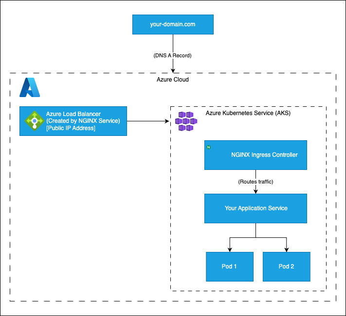

# Deploying Containerized Applications on Azure Kubernetes Service (AKS) with NGINX and Automated TLS

This repository provides a complete, end-to-end solution for deploying containerized workloads on Azure Kubernetes Service (AKS) using Terraform. It includes a reusable Terraform module to provision the core infrastructure and demonstrates how to deploy a sample application with an NGINX Ingress Controller and automated HTTPS using cert-manager and Let's Encrypt.

This project is an Azure equivalent of the popular pattern for deploying containerized services with a reverse proxy, adapted for the Kubernetes ecosystem.

### Architecture Overview


## Features
- **Infrastructure as Code:** The entire Azure infrastructure (AKS, Resource Group) is defined and managed using Terraform.
- **Modular Terraform Design:** A reusable module (./modules/aks-nginx) makes it easy to spin up new AKS clusters consistently.
- **NGINX Ingress Controller:** Uses the industry-standard NGINX Ingress Controller for robust traffic management.
- **Automated TLS/SSL:** Integrates with cert-manager to automatically provision and renew free TLS certificates from Let's Encrypt.
- **Sample Application:** Includes a complete example of deploying a static HTML page served by NGINX to demonstrate the workflow.
- **Scalable and Production-Ready:** The architecture is suitable as a baseline for deploying complex microservices.

## Prerequisites
Before you begin, ensure you have the following tools installed and configured:

1. Terraform (version >= 1.0.0)
2. Azure CLI
3. kubectl
4. An Azure Account with an active subscription.
5. A Registered Domain Name that you can manage DNS records for.

## Project Structure
```
.
│── main.tf
│── outputs.tf
│── terraform.tfvars
│── variables.tf
├── modules/
│   └── aks-nginx/
│       ├── main.tf
│       ├── outputs.tf
│       └── variables.tf
├── k8s/
│   ├── deployment.yaml
│   ├── cert-manager.yaml
│   ├── letsencrypt-clusterissuer.yaml
│   ├── html-configmap.yaml
│   ├── ingress.yaml
│   └── service.yaml
└── README.md
```

## Step-by-Step Deployment Guide
Follow these steps to deploy the entire stack.

### Step 1: Clone the Repository
Clone this repository to your local machine:
```
git clone <this-repo-url>
cd <repository-folder-name>
```

### Step 2: Log in to Azure
Authenticate with the Azure CLI. This will open a browser window for you to sign in.
```
az login
```

Set the subscription you want to use for the deployment:
```
az account set --subscription "Your-Subscription-Name-or-ID"
```

### Step 3: Deploy the AKS Infrastructure
Navigate to the root directory and initialize Terraform.
```
terraform init
```

Review the `terraform.tfvars` file and update it with your desired settings if needed. Now, apply the Terraform configuration to create the AKS cluster.
```
terraform apply
```
Terraform will show you a plan and ask for confirmation. Type yes to proceed. This process will take several minutes to complete.

### Step 4: Configure `kubectl`
Once the Terraform apply is complete, configure `kubectl` to connect to your new AKS cluster.
```
az aks get-credentials --resource-group $(terraform output -raw resource_group_name) --name $(terraform output -raw aks_cluster_name)
```

Verify that you can connect to the cluster:
```
kubectl get nodes
```
You should see the nodes of your cluster listed with a Ready status.

### Step 5: Deploy cert-manager
`cert-manager` is a Kubernetes add-on that automates the management of TLS certificates. Navigate back to the root of the project directory and apply the manifest.
```
cd ..
kubectl apply -f k8s/cert-manager.yaml
```

Wait for the cert-manager pods to be fully running in their own namespace before proceeding.
```
# Wait for the output to show 3/3 ready pods
kubectl get pods -n cert-manager
```

### Step 6: Create the Let's Encrypt ClusterIssuer
A ClusterIssuer is a cert-manager resource that can issue certificates across all namespaces in your cluster.

First, edit the file `k8s/letsencrypt-clusterissuer.yaml` and replace the placeholder `YOUR_EMAIL_ADDRESS_HERE` with your actual email address. Let's Encrypt uses this to notify you about your certificate status.

Then, apply the manifest:
```
kubectl apply -f k8s/letsencrypt-clusterissuer.yaml
```

### Step 7: Deploy the Sample Application
Now you will deploy the simple HTML website. This step also creates the Ingress resource that triggers the certificate creation.

First, edit the file `k8s/ingress.yaml` and replace all instances of `your-domain.com` with the domain name you own.

Apply the manifest to deploy the application, its service, and the Ingress:
```
kubectl apply -f k8s/html-configmap.yaml
kubectl apply -f k8s/deployment.yaml
kubectl apply -f k8s/service.yaml
kubectl apply -f k8s/ingress.yaml
```

### Step 8: Configure DNS
This is a critical step. `cert-manager` needs to verify that you own the domain you're requesting a certificate for.

1. Find the Public IP of the Ingress Controller: The NGINX Ingress Controller service was created when you ran `terraform apply`. Get its public IP address:
```
kubectl get service -n ingress-nginx
```
    
Look for the `EXTERNAL-IP` of the `nginx-ingress-ingress-nginx-controller` service. It might take a minute to appear.

2. Create a DNS 'A' Record: Go to your domain registrar's DNS management panel and create an 'A' record that points your domain (e.g., `your-domain.com`) to the `EXTERNAL-IP` you just found.

## Verification
Once the DNS has propagated, `cert-manager` will be able to complete the certificate issuance process.

1. Check Certificate Status:
```
kubectl get certificate
```

You should see your certificate with `READY` set to `True`. This can take a few minutes. If it's `False`, use `kubectl describe certificate <your-cert-name>` to debug.

2. Access Your Site:
Open your web browser and navigate to `https://your-domain.com`. You should see the "Hello from AKS!" page, and your browser should show a valid lock icon, indicating a secure HTTPS connection.

## Cleaning Up
To avoid ongoing charges, destroy all the resources you've created.

1. Destroy Azure Infrastructure:
Navigate back to the root directory and run terraform destroy.

```
terraform destroy
```
Confirm by typing `yes`.

2. Delete DNS Record:
Don't forget to remove the 'A' record from your domain registrar's DNS settings.

